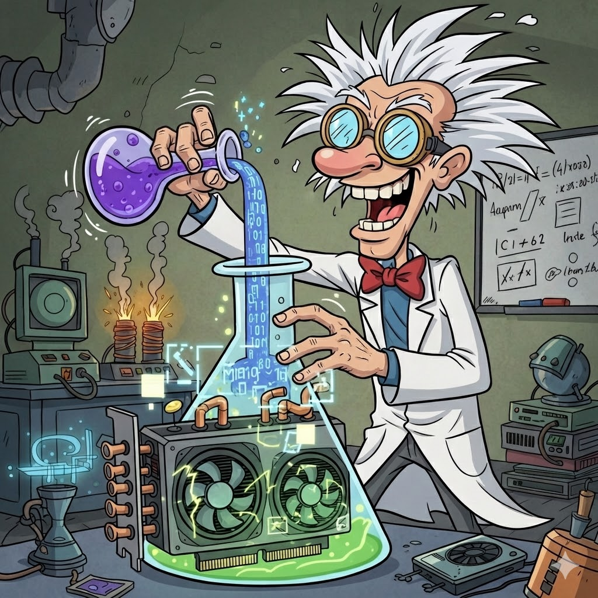
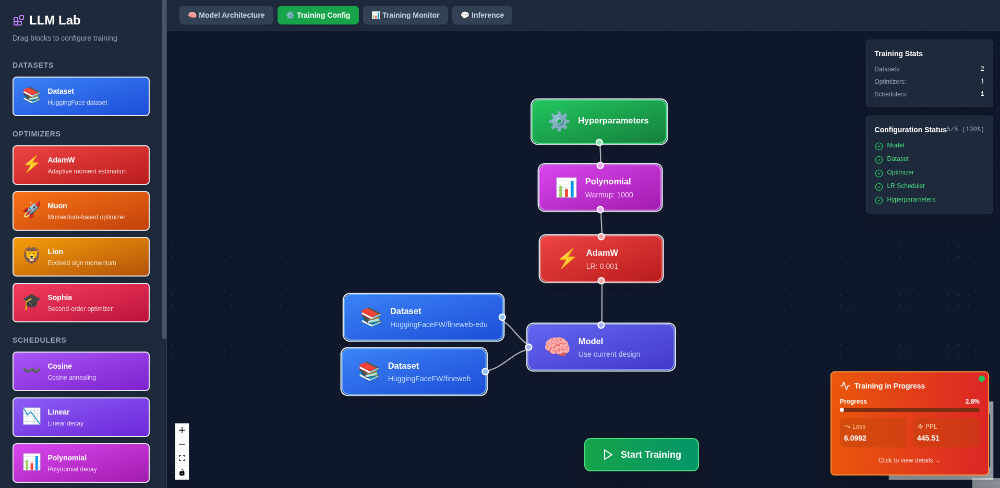
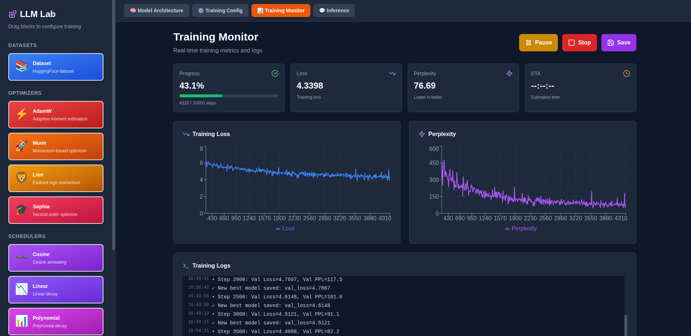

# 🧪 LLM-Lab

<p align="center">
  
</p>

**A mad scientist's playground for training Large Language Models at home.**

<p align="center">
  <em>“Why would anyone train an LLM from scratch in their garage?”</em><br/>
  — Reasonable people
</p>

<p align="center">
  <strong>“Because we can!”</strong><br/>
  — Us
</p>

Welcome to LLM-Lab, where we take perfectly good GPUs and turn them into tiny fireballs of matrix multiplication. This is a **completely experimental, utterly unnecessary, but incredibly fun** framework for training and fine-tuning LLMs from scratch. No cloud credits required. Just you, your GPU, and questionable life choices.

## 🎯 What's This Madness?

LLM-Lab lets you:
- ⚡ Train language models **from scratch** (yes, really!)
- 🎨 Fine-tune them with **SFT** (make them follow instructions)
- 🎖️ Align them with **RLHF** using PPO, DPO, or GRPO (make them less chaotic)
- 🔀 Play with **LoRA** adapters (save GPU memory for more experiments)
- 🧩 Try **Transformer** architectures (boring but reliable) or **Mamba2** (spicy state-space models)
- 🎪 Add **Mixture of Experts** (because one model is never enough)

All of this runs in a Docker container, consuming your electricity bill and making your GPU fans sound like a jet engine. Worth it? Absolutely.

## 🚀 Quick Start (The "I Have No Idea What I'm Doing" Guide)

### Prerequisites
- An NVIDIA GPU (the fancier, the better - RTX 4090 recommended, but anything modern works)
- Docker with NVIDIA Container Toolkit installed
- A sense of adventure
- Low expectations

### Launch the Lab

```bash
docker run -d -p 8000:8000 \
  --gpus all \
  -v $(pwd)/data:/app/data \
  --name llm-lab \
  blazux/llm-lab:latest
```

**That's it!** You now have:
- 🌐 A fancy web UI at http://localhost:8000
- 🖥️ A retro-style CLI (access with `docker exec -it llm-lab ../../llm-lab.sh`)
- 💾 A `data/` folder where all your precious checkpoints live

### What's in the data/ folder?

```
data/
├── best_model.pt              # Your best checkpoint (or worst, we don't judge)
├── final_model.pt             # When training completes
├── latest_checkpoint.pt       # For when things crash (they will)
├── model_config.json          # Model architecture config
├── config.json                # HuggingFace-compatible config
├── training_config.json       # Training hyperparameters
├── best_lora_adapters/        # LoRA adapters if you used them
└── cache/                     # Tokenizers and dataset cache
```

Everything stays in `/app/data/` - no more subdirectories, no more confusion!

## 🎮 The CLI Experience

Launch the CLI and you'll be greeted by a glorious retro menu:

```
╔═══════════════════════════════════════════════════════════════╗
║                   L L M - L A B O R A T O R Y                 ║
║       Train, fine-tune, and test custom language models       ║
╚═══════════════════════════════════════════════════════════════╝

┌─ Main Menu ─────────────────────────────────────────────────┐

  ⚙️  MODEL SETUP
  ├────────────────────────────────────────────────────────────
  │ 1. Configure new model
  │    Define architecture, choose attention mechanisms, etc.

  🚂 TRAINING
  ├────────────────────────────────────────────────────────────
  │ 2. Base training (pretraining)
  │    Train from scratch on massive text datasets
  │
  │ 3. SFT training (instruction tuning)
  │    Fine-tune on instruction-following datasets
  │
  │ 4. RLHF training (alignment)
  │    Align with human preferences using PPO, DPO, or GRPO

  🔧 TOOLS & UTILITIES
  ├────────────────────────────────────────────────────────────
  │ 5. Merge LoRA adapters
  │    Bake LoRA weights into base model
  │
  │ 6. Checkpoint info
  │    Display detailed checkpoint information (with token reset!)
  │
  │ 7. Test model (inference)
  │    Play with your trained model
  │
  │ 8. Export to HuggingFace
  │    Publish your model to HuggingFace Hub
  │
  │ 9. Exit
  │    Go outside, touch grass

└──────────────────────────────────────────────────────────────┘
```

## 🎨 The Web UI (For Visual Learners)

The web interface is a drag-and-drop playground where you can visually build your model architecture:

**Model Configuration - Build Your Frankenstein**

*Drag attention heads, normalization layers, and activations like you're playing with LEGO*

**Training Configuration - Set It and Forget It**

*Configure optimizers, learning rates, and watch your GPU go brrr*

**Training Monitor - Watch Numbers Go Down (Hopefully)**

*Real-time metrics, because anxiety is a feature*

> **Note:** The web UI is still a work in progress. When in doubt, use the CLI - it has all the features and won't let you down (much).

## 🧬 What Can You Build?

### Transformer Models
The tried-and-true architecture that powers ChatGPT, LLaMA, and every other LLM you've heard of:

- **Attention Types**: MHA, GQA (Llama-style), MQA, MLA (DeepSeek-style KV compression)
- **Positional Encodings**: RoPE, YARN, ALiBi, Sinusoidal, Learned
- **Activations**: SwiGLU, GeGLU, ReGLU, ReLU, GELU
- **Mixture of Experts**: Because one FFN per layer is for cowards

### Mamba2 Models
State-space models with **O(N) complexity** instead of O(N²). Faster inference, lower memory, but still experimental:

- Linear-time sequence processing
- No attention mechanism (wild, right?)
- Built-in convolution for positional awareness
- Perfect for long sequences

### LoRA (Low-Rank Adaptation)
Train on a potato? LoRA lets you fine-tune with a fraction of the memory:

- **Presets**: minimal, attention_only, ffn_only, all, custom
- Merge adapters back into the model when done
- Stack multiple LoRA stages: Base → SFT (LoRA) → merge → RLHF (LoRA) → merge

## 🎓 The Full Training Pipeline

### 1. Design Your Model (Option 1)
Pick your architecture, set your size, choose your fancy attention mechanism. Make it tiny (150M params) for experiments or huge (7B+) if your electricity bill means nothing to you.

### 2. Pretrain from Scratch (Option 2)
Throw gigabytes of text at your model and watch it learn to predict the next word. Uses industry-standard datasets like FineWeb-Edu (1.3T tokens). Estimated time: hours to weeks depending on your GPU and ambitions.

### 3. Supervised Fine-Tuning / SFT (Option 3)
Teach your model to follow instructions using datasets like Alpaca, Dolly, or your own. Optional LoRA for efficiency.

### 4. RLHF Training (Option 4)
Align your model with human preferences:
- **PPO**: Classic reinforcement learning (needs reward model)
- **DPO**: Direct preference optimization (no reward model needed!)
- **GRPO**: Group relative policy optimization (middle ground)

### 5. Test and Deploy (Option 7)
Chat with your creation. Bask in glory or despair. Probably despair initially, but that's part of the fun.

### 6. Checkpoint Inspector (Option 6)
View everything about your checkpoints:
- Architecture details
- Training progress
- Performance metrics
- LoRA status
- **Bonus**: Reset token counters if you want to track from scratch

### 7. Merge LoRA Adapters (Option 5)
Bake your LoRA weights into the base model. Essential for stacking training stages.

### 8. Export to HuggingFace (Option 8)
Publish your trained model to HuggingFace Hub with one click. The export automatically detects the best format based on your model configuration.

## 🤗 HuggingFace Export & vLLM Compatibility

Not all model configurations are created equal when it comes to inference tools. Here's what you need to know:

### Export Format Detection

| Architecture | Attention | Pos. Encoding | Activation | MoE | Export Format | vLLM Compatible |
|--------------|-----------|---------------|------------|-----|---------------|-----------------|
| Transformer | GQA | RoPE | SwiGLU | No | `llama` | ✅ **Yes** |
| Transformer | MHA | RoPE | SwiGLU | No | `llama` | ✅ **Yes** |
| Transformer | MQA | RoPE | SwiGLU | No | `llama` | ✅ **Yes** |
| Transformer | GQA | RoPE | SwiGLU | Yes | `mixtral` | ✅ **Yes** |
| Transformer | MLA | RoPE | SwiGLU | No | `custom` | ❌ No* |
| Transformer | GQA | ALiBi | SwiGLU | No | `custom` | ❌ No* |
| Transformer | GQA | Sinusoidal | SwiGLU | No | `custom` | ❌ No* |
| Transformer | GQA | RoPE | GeGLU | No | `custom` | ❌ No* |
| Mamba2 | N/A | N/A | N/A | N/A | `custom` | ❌ No* |

*\*Custom format models require `trust_remote_code=True` when loading with transformers.*

### What This Means

**vLLM Compatible (`llama` / `mixtral` format):**
- Native support in vLLM, TGI, and other inference servers
- Optimized CUDA kernels for maximum throughput
- No custom code needed to load
- Just run: `vllm serve username/your-model`

**Custom Format:**
- Works with `transformers` library using `trust_remote_code=True`
- Model code is bundled in the HuggingFace repo
- Slower inference (no optimized kernels)
- May not work with all inference tools

### Recommended Configurations for Production

If you want your model to be **vLLM compatible** for fast inference, use:
```
Architecture:        transformer
Attention:           gqa (or mha)
Positional Encoding: rope
Activation:          swiglu
MoE:                 false (or true for Mixtral-style)
```

This matches the Llama architecture and will export in a format that vLLM recognizes natively.

### Setting Up HuggingFace Credentials

To push models to HuggingFace Hub, you need an API token. Here are the options:

**Option 1: Environment Variable (Recommended for Docker)**
```bash
# Add to your docker run command
docker run -d -p 8000:8000 \
  --gpus all \
  -v $(pwd)/data:/app/data \
  -e HF_TOKEN="hf_your_token_here" \
  --name llm-lab \
  blazux/llm-lab:latest
```

Or set it in your shell:
```bash
export HF_TOKEN="hf_your_token_here"
# or
export HUGGING_FACE_HUB_TOKEN="hf_your_token_here"
```

**Option 2: CLI Prompt**

If no token is found, the CLI will ask for it:
```
⚠ No HF_TOKEN found in environment
➤ HuggingFace API token (or press Enter to use cached):
```

**Option 3: HuggingFace CLI Login**

If you've logged in before with the `huggingface-cli`, the cached token will be used automatically:
```bash
pip install huggingface_hub
huggingface-cli login
```

> **Get your token at:** https://huggingface.co/settings/tokens (requires "Write" permission)

## 🛠️ Project Structure

```
LLM-Lab/
├── src/
│   ├── cli.py                 # The beautiful CLI
│   ├── config/                # Configuration classes
│   ├── model/                 # Transformer & Mamba2 implementations
│   ├── training/              # Training loops (base, SFT, PPO, DPO, GRPO)
│   ├── inference/             # Text generation
│   ├── data/                  # Dataset loaders
│   └── optimizers/            # AdamW, Lion, Sophia, Muon, etc.
├── gui/
│   ├── frontend/              # React + TypeScript web UI
│   └── backend/               # FastAPI backend
├── data/                      # Your checkpoints and configs live here
├── docs/                      # Extensive documentation
└── Dockerfile                 # One-command deployment
```

## 🔬 Features That Definitely Work (Probably)

- ✅ **Multiple Architectures**: Transformers and Mamba2
- ✅ **Complete Pipeline**: Pretrain → SFT → RLHF
- ✅ **Modern Optimizers**: AdamW, Adafactor, Lion, Sophia, Muon
- ✅ **LoRA Support**: Save memory, train more
- ✅ **Web UI + CLI**: Pick your poison
- ✅ **Real-time Monitoring**: Watch loss curves in real-time
- ✅ **Checkpoint Inspector**: Know everything about your models
- ✅ **LoRA Merger**: Stack training stages like pancakes
- ✅ **HuggingFace Export**: One-click publish to Hub (vLLM compatible!)

## 📚 Documentation (For When Things Inevitably Break)

- 📖 **[Complete Documentation](docs/index.md)** - Start here
- 🚂 **[Full Training Guide](docs/full-guide.md)** - Step-by-step for the entire pipeline
- 🐍 **[Mamba2 Guide](docs/mamba2.md)** - State-space model deep dive

## ⚠️ Warnings & Disclaimers

- This will make your GPU hot. Very hot.
- Training from scratch takes days/weeks, not hours
- Your first model will probably be terrible (that's normal!)
- Electricity bills may increase
- Neighbors may complain about fan noise
- You might become obsessed with loss curves

## 🤝 Contributing

Found a bug? Have a crazy idea? Want to add support for another exotic architecture?

**Pull requests welcome!** This is an experimental playground - if it's weird, experimental, or fun, we want it.

## 💡 Why Would Anyone Do This?

Good question! Here are some reasons:

1. **Learning**: There's no better way to understand LLMs than building one
2. **Control**: You own your models, your data, your weights
3. **Experimentation**: Try architectures/techniques that don't exist yet
4. **Bragging Rights**: "I trained my own LLM" > "I fine-tuned someone else's"
5. **Because We Can**: Honestly, this is probably the main reason

## 📜 License

MIT License - Do whatever you want with this code. Train models, break things, have fun!

---

**Built with ❤️, caffeine, and questionable judgment**
