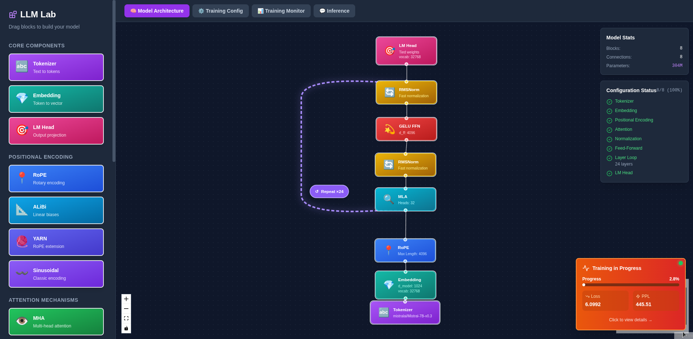

# LLM-Lab

A flexible framework for training and fine-tuning Large Language Models from scratch, with support for both Transformer and Mamba2 architectures.

## Features

- **Multiple Architectures**: Transformer (MHA, MQA, GQA) and Mamba2 State Space Models
- **Complete Training Pipeline**: Base training → SFT → RLHF
- **RLHF Algorithms**: PPO, DPO, and GRPO
- **LoRA Support**: Parameter-efficient fine-tuning for both architectures
- **Modern Optimizers**: AdamW, Adafactor, Lion, Sophia, Muon
- **Flexible Configuration**: Interactive CLI or JSON configs

## Quick Start

### Option 1: Docker (Recommended)

You'll need an NVIDIA GPU and nvidia-docker installed:

```bash
docker run -d -p 8000:8000 \
  --gpus all \
  -v $(pwd)/checkpoints:/app/checkpoints \
  -v $(pwd)/cache:/app/cache \
  --name llm-lab \
  blazux/llm-lab
```

Access the web interface at http://localhost:8000

or

Launch the CLI : 
```bash
docker exec -it llm-lab ../../llm-lab.sh
```

**The web interface is a work in progress and is far from offering all the features of the CLI version.**

#### Web Interface

The web interface provides a visual workflow for configuring and training your models:

**Model Configuration**


**Training Configuration**


**Training Monitor**


### Option 2: Local Installation

```bash
pip install -r requirements.txt
```

**Optional (for Mamba2 with optimized kernels):**
```bash
pip install mamba-ssm>=2.0.0 causal-conv1d>=1.2.0
```

### Training Workflow

```bash
# Launch interactive CLI
./llm-lab.sh
```

**Typical pipeline:**

1. **Configure your model** (Option 1)
   - Choose architecture: Transformer or Mamba2
   - Set model size, attention type, activation, etc.

2. **Train from scratch** (Option 2)
   - Configure datasets, optimizer, learning rate, etc.
   - Run base training on text corpora

3. **Supervised Fine-Tuning** (Option 3)
   - Fine-tune on instruction datasets
   - Optional: Use LoRA for memory efficiency

4. **RLHF Training** (Option 4)
   - Choose algorithm: PPO, DPO, or GRPO
   - Align model with human preferences

5. **Test your model** (Option 6)
   - Run inference to test outputs

## Requirements

- Python 3.8+
- PyTorch 2.0+ with CUDA
- GPU with bfloat16 support (recommended)
- See `requirements.txt` for full dependencies

## Documentation

📚 **[Complete Documentation](docs/index.md)** - Single entry point for all documentation

**Main guides:**
- [Complete Training Guide](docs/full-guide.md) - Step-by-step guide for all training stages
- [Mamba2 Guide](docs/mamba2.md) - State space model documentation


## Contributing

Feel free to open issues or submit pull requests for bugs, features, or improvements.

## License

Under MIT License.
